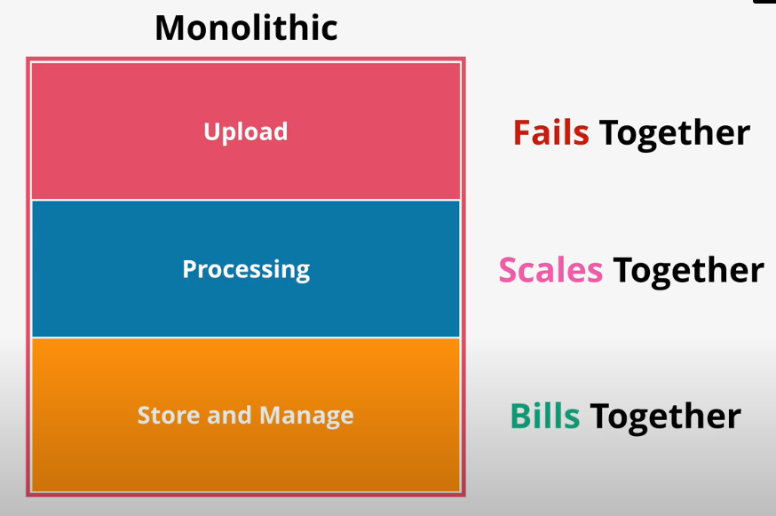
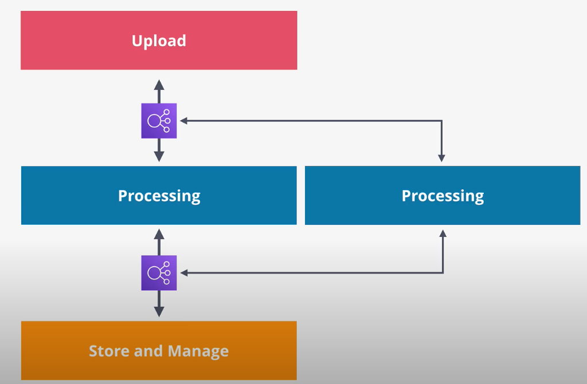
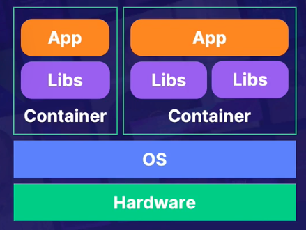

### Table of Contents

- [What is serverless?](#what-is-serverless)
- [Simple Architecture Overview](#simple-architecture-overview)
  - [Monoliths](#monoliths)
  - [Tiered](#tiered)
  - [Decoupled Architecture](#decoupled-architecture)
  - [Microservice Architecture](#microservice-architecture)
- [What is Lambda?](#what-is-lambda)
  - [Lambda Function](#lambda-function)
  - [Lambda Concurrency](#lambda-concurrency)
  - [Synch vs Asynch Invocation](#synch-vs-asynch-invocation)
  - [Lambda Demo](#lambda-demo)
- [What is a Container?](#what-is-a-container)
  - [Terminology](#terminology)
  - [What is ECS?](#what-is-ecs)
- [What is Fargate?](#what-is-fargate)
- [What is Amazon EventBridge?](#what-is-amazon-eventbridge)
  - [Usage](#usage)
  - [EventBridge Demo](#eventbridge-demo)

## What is serverless?

Serverless is a development methodology where we focus on code and leave the management of the compute architecture up to a managed service. Why is serverless beneficial?

- Due to ease of use: we don't worry about allocating resources but instead focus on our business logic
- Serverless compute resources can be brought online in response to an event happening
- Pay as you go model!

## Simple Architecture Overview

### Monoliths

Let's start with why we're not going with monoliths: this implies that all different components of our application live together.This means that if one component of our architecture fails, then the entire app fails. For example, if our app has upload, processing and storage/manage layers, all layers will fail if say upload fails in a monolithic setup.

Secondly, the architecture is only vertically scalable since we have the need to run all components on the same machine.

Finally, generally all components of a monolithic architecture are billed together. So, for example, if our app (upload, processing and storage/manage) is to remain operational, we'll have to keep all layers running even if we're not using say the storage/manage layer.

content/images/aws/monolith.png

[Image Credit: learn.cantrill.io](https://learn.cantrill.io/courses/730712/lectures/15190436)

### Tiered

Building upon monoliths, let's see how we can add some "tiering" to our architecture to address some shortcomings.In a tiered architecture, we break the monolith apart and have a collection of different tiers that can be on the same server or different servers.

One advantage of tiered architecture is that we can scale each tier independently. However, we still have a tightly coupled system since a single endpoint of say the upload tier, connects to a single endpoint of processing tier. To solve for that, we can have internal load balancers where each tier is not communicating with a "single instance" of another tier. This allows for horizontal scaling.

This still isn't the ideal solution. That's because the upload tier expects and requires the processing tier to be available and responsive. So if our processing tier is not present and someone tries to upload something, the operation will fail since there's nothing present to process uploads. We're still tightly coupled.

[Image Credit: learn.cantrill.io](https://learn.cantrill.io/courses/730712/lectures/15190436)

### Decoupled Architecture

Previous architecture's shortcomings can be addressed evolved using queues. Here, we add queue between each tier. This allows upload tier to transfer uploaded videos to a queue (SQS) without worrying about the processing tier. Processing tier can then extract items from the queue whenever it becomes available.

On the output side of the queue, we can have an auto-scaling group.This group can have configuration of min = 0, desired = 0 and max = 1337! ASG has policies that provisions or terminates instances based on auto-scaling policies. We can configure this policy to keep an eye on the queue length. Queue length is just the number of items in the queue.

As the length of our queue increases (say to 3), ASG will provision instances since current queue size (which is 3) > desired size (which is 0). These instances will poll the queue for messages that were placed there by the upload tier. As queue size decreases, ASG reduces the number of instances present to process our queue. We've now decoupled our service!

### Microservice Architecture

As we break down our monolith app into smallest unit possible, we arrive at the microservice architecture. In our example, we can have upload µservice, processing µservice and storaga/manage µservice. Now imagine if we have a more complex use-case where a lot of µservices need to communicate with each other! We'll have a lot of queues to manage. This approach can work but it'll be too cumbersome to manage all the queues.

## What is [Lambda](https://docs.aws.amazon.com/lambda/latest/dg/welcome.html)?

Lambda is a compute service that lets you run code without provisioning or managing servers. Lambda runs your code on a high-availability compute infrastructure and performs all of the administration of the compute resources, including server and operating system maintenance, capacity provisioning and automatic scaling, code monitoring and logging.

You organize your code into Lambda functions. Functions are loaded and run in a runtime environment (such as python 3.8, NodeJS, Ruby, Java, Go, C# etc). Lambda runs your function only when needed and scales automatically, from a few requests per day to thousands per second.

Lambda manages the infrastructure that runs your code, and scales automatically in response to incoming requests. If traffic volume increases, lambda scales up by running additional instances. When traffic subsides, inactive instances are frozen or stopped.

### Lambda Function

The Lambda function is the foundational principle of Lambda. You can configure your functions using the Lambda console, Lambda API, AWS CloudFormation or AWS SAM. You create code for the function and upload the code using a deployment package. Lambda invokes the function when an event occurs. Lambda runs multiple instances of your function in parallel, governed by concurrency and scaling limits.

To have a fully functional lambda function, you need the following:

- A runtime that you choose which is the environment your code will run in
- You'll need IAM roles/permissions attached to lambda functions to make API calls
- You can optionally define VPCs and subnets where your lambda functions can reside
- You can define the CPU and RAM your code gets to use
- Finally a trigger that allows our lambda function to execute

**Your lambda function cannot run longer than 15 minutes**

[Image Credit: Acloudguru](https://acloudguru.com)

### Lambda Concurrency

Use concurrency settings to ensure that your production applications are highly available and highly responsive. To prevent a function from using too much concurrency, and to reserve a portion of your account's available concurrency for a function, use reserved concurrency. Reserved concurrency splits the pool of available concurrency into subsets. A function with reserved concurrency only uses concurrency from its dedicated pool.

To enable functions to scale without fluctuations in latency, use provisioned concurrency. For functions that take a long time to initialize, or that require extremely low latency for all invocations, provisioned concurrency enables you to pre-initialize instances of your function and keep them running at all times. Lambda integrates with Application Auto Scaling to support autoscaling for provisioned concurrency based on utilization.

### Synch vs Asynch Invocation

When you invoke a function, you can choose to invoke it synchronously or asynchronously. With synchronous invocation, you wait for the function to process the event and return a response. With asynchronous invocation, Lambda queues the event for processing and returns a response immediately.

For asynchronous invocations, Lambda handles retries if the function returns an error or is throttled. To customize this behavior, you can configure error handling settings on a function, version, or alias. You can also configure Lambda to send events that failed processing to a dead-letter queue, or to send a record of any invocation to a destination.

### Lambda Demo

Let's create a lambda function that gets triggered whenever an EC2 instance is created. We'll check to see if the EC2 instance launched has a name tag. If so, we do nothing, otherwise, we kill that instnace. As with every AWS service, we need to add EC2 access policy and Lambda execution policy to the lambda function IAM role.

<!-- copy and paste. Modify height and width if desired. -->
<iframe class="embeddedObject shadow resizable" name="embedded_content" scrolling="no" frameborder="0" type="text/html" 
        style="overflow:hidden;" src="https://www.screencast.com/users/IqbalKhan8502/folders/Capture/media/215ef001-a6f3-403e-b3a0-227367ddaefe/embed" height="764" width="1436" webkitallowfullscreen mozallowfullscreen allowfullscreen></iframe>

## What is a Container?

Container is a unit of software that packages up code and all its dependencies so the application runs quickly and reliably from one env to another.

[Image Credit: Acloudguru](https://acloudguru.com)

### Terminology

Let's see what most commonly used terms within containers mean:

- Dockerfile

This is the file that contains all the commands or instructions that will be used to build an image.

- Image

Immutable file that contains the code, libraries, dependencies, and config files needed to run an application.

- Registry

Stores docker images for distribution. They can be private or public

- Container

A running copy of the image that has been created

In the AWS world, you create your containers on EC2 instances. Now managing all these containers can be cumbersome if we have a lot of containers. Enter, ECS:

### What is [ECS](https://docs.aws.amazon.com/AmazonECS/latest/developerguide/Welcome.html)?

Amazon Elastic Container Service (Amazon ECS) is a highly scalable, fast container management service that makes it easy to run, stop, and manage containers on a cluster. Your containers are defined in a task definition that you use to run individual tasks or tasks within a service. In this context, a service is a configuration that enables you to run and maintain a specified number of tasks simultaneously in a cluster. You can run your tasks and services on a serverless infrastructure that is managed by AWS Fargate. Alternatively, for more control over your infrastructure, you can run your tasks and services on a cluster of Amazon EC2 instances that you manage.

Amazon ECS enables you to launch and stop your container-based applications by using simple API calls. You can also retrieve the state of your cluster from a centralized service and have access to many familiar Amazon EC2 features.

ECS allows you to:

- Manage containers at scale
- Integrates with ELB
- Easy intergration with roles

## What is Fargate?

AWS Fargate is a technology that provides on-demand, right-sized compute capacity for containers. With AWS Fargate, you don't have to provision, configure, or scale groups of virtual machines on your own to run containers. You also don't need to choose server types, decide when to scale your node groups, or optimize cluster packing. You can control which pods start on Fargate and how they run with Fargate profiles.

When using Fargate, you delegate the infra setup to AWS and you focus only on the task at hand! Fargate requires use of ECS or EKS. You pay based on resources allocated and time ran. Fargate is great for short-running tasks. It is like lambda for ECS! Fargate is a serverless compute option.

## What is [Amazon EventBridge](https://docs.aws.amazon.com/eventbridge/latest/userguide/eb-what-is.html)?

Amazon EventBridge is a serverless event bus service that you can use to connect your applications with data from a variety of sources. EventBridge delivers a stream of real-time data from your applications, software as a service (SaaS) applications, and AWS services to targets such as AWS Lambda functions, HTTP invocation endpoints using API destinations, or event buses in other AWS accounts.

EventBridge receives an event, an indicator of a change in environment, and applies a rule to route the event to a target. Rules match events to targets based on either the structure of the event, called an event pattern, or on a schedule. For example, when an Amazon EC2 instance changes from pending to running, you can have a rule that sends the event to a Lambda function.

All events that come to EventBridge are associated with an event bus. Rules are tied to a single event bus, so they can only be applied to events on that event bus. Your account has a default event bus which receives events from AWS services, and you can create custom event buses to send or receive events from a different account or Region.

### Usage

To use EventBridge, you need the following:

- Define Pattern

This is where you define when the "rule" gets triggered: When something happens or at a particular time?

- Select Event

Is this going to be an AWS-based event? A custome event or a partner event?

- Target

What happens when this event kicks off? Do you trigger a lmabda function, post to SQS or send an email?

### EventBridge Demo

In this demo we'll use an eventbridge, EB, that keeps an eye on EC2 instances. As soon as an instance is stopped, we'll trigger an event that gets to EB and triggers a lambda that turns that instance back on! Here's the lambda function:

```python
#!/usr/bin/python
import boto3
import logging

#setup simple logging for INFO
logger = logging.getLogger()
logger.setLevel(logging.INFO)

#define the connection
ec2 = boto3.resource('ec2')

def lambda_handler(event, context):
    # Use the filter() method of the instances collection to retrieve
    # all running EC2 instances.
    filters = [
        {
            'Name': 'instance-state-name',
            'Values': ['stopped']
        }
    ]

    #filter the instances
    instances = ec2.instances.filter(Filters=filters)

    #locate all running instances
    stoppedInstances = [instance.id for instance in instances]

    #print the instances for logging purposes
    #print stoppedInstances

    #make sure there are actually instances to shut down.
    if len(stoppedInstances) > 0:
        #perform the shutdown
        startingUp = ec2.instances.filter(InstanceIds=stoppedInstances).start()
        print (startingUp)
    else:
        print ("Nothing to see here")
```

Remember to add EC2 permissions and BasicExecution permissions to the lambda that you create.

- Go to EventBridge -> Events -> Rules -> Create Rule
- Choose Event pattern
- Choose pre-defined pattern by service, select AWS and choose EC2
- For event type choose EC2 Instance State-change Notification
- Choose specific states and choose stopped
- For Target, choose a lambda function that you created (as pasted above!).
- Go to EC2 and stop a running EC2 instance

<!-- copy and paste. Modify height and width if desired. -->
<iframe class="embeddedObject shadow resizable" name="embedded_content" scrolling="no" frameborder="0" type="text/html" 
        style="overflow:hidden;" src="https://www.screencast.com/users/IqbalKhan8502/folders/Capture/media/a15dcf4b-9954-42e4-99ab-e0a5cc1afa7b/embed" height="932" width="1916" webkitallowfullscreen mozallowfullscreen allowfullscreen></iframe>

You can kick off the lambda function for any API call you want!
