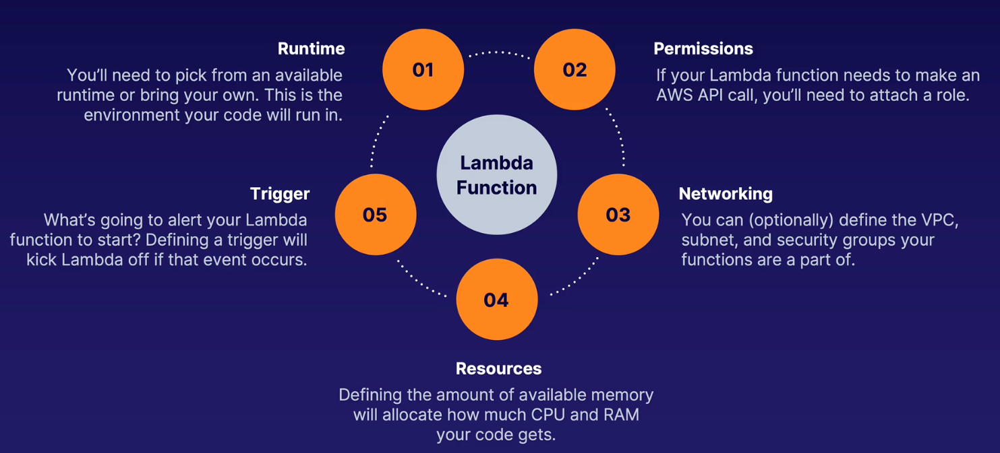
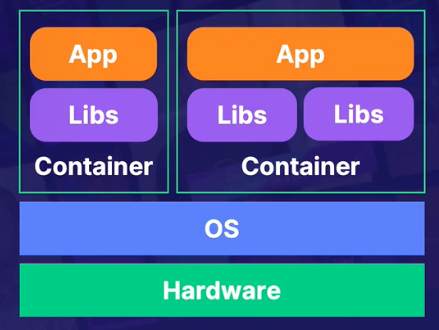

---
date: 2022-01-05
draft: false
thumbnail: /post-images/lambda.png
title: AWS - Serverless
extract: Notes for AWS Serverlesss
categories:
    - AWS
tags:
    - blog
    - AWS
--- 

### Table of Contents

- [What is serverless?](#what-is-serverless)
- [What is Lambda?](#what-is-lambda)
  - [Lambda Function](#lambda-function)
  - [Lambda Concurrency](#lambda-concurrency)
  - [Synch vs Asynch Invocation](#synch-vs-asynch-invocation)
  - [Lambda Demo](#lambda-demo)
- [What is a Container?](#what-is-a-container)
  - [Terminology](#terminology)
  - [What is ECS?](#what-is-ecs)

## What is serverless?

Serverless is a development methodology where we focus on code and leave the management of the compute architecture up to a managed service. Why is serverless beneficial?

- Due to ease of use: we don't worry about allocating resources but instead focus on our business logic
- Serverless compute resources can be brought online in response to an event happening
- Pay as you go model! 

## What is [Lambda](https://docs.aws.amazon.com/lambda/latest/dg/welcome.html)?

Lambda is a compute service that lets you run code without provisioning or managing servers. Lambda runs your code on a high-availability compute infrastructure and performs all of the administration of the compute resources, including server and operating system maintenance, capacity provisioning and automatic scaling, code monitoring and logging. With Lambda, you can run code for virtually any type of application or backend service. You organize your code into Lambda functions. Lambda runs your function only when needed and scales automatically, from a few requests per day to thousands per second. You pay only for the compute time that you consume—there is no charge when your code is not running.

Lambda manages the infrastructure that runs your code, and scales automatically in response to incoming requests. When your function is invoked more quickly than a single instance of your function can process events, Lambda scales up by running additional instances. When traffic subsides, inactive instances are frozen or stopped. You pay only for the time that your function is initializing or processing events.

### Lambda Function

The Lambda function is the foundational principle of Lambda. You can configure your functions using the Lambda console, Lambda API, AWS CloudFormation or AWS SAM. You create code for the function and upload the code using a deployment package. Lambda invokes the function when an event occurs. Lambda runs multiple instances of your function in parallel, governed by concurrency and scaling limits.

To have a fully functional lambda function, you need the following:

- A runtime that you choose which is the environment your code will run in
- You'll need IAM roles/permissions attached to lambda functions to make API calls
- You can optionally define VPCs and subnets where your lambda functions can reside
- You can define the CPU and RAM your code gets to use
- Finally a trigger that allows our lambda function to execute

**Also, your lambda function cannot run longer than 15 minutes**

[Image Credit: Acloudguru](https://acloudguru.com)

### Lambda Concurrency

Use concurrency settings to ensure that your production applications are highly available and highly responsive. To prevent a function from using too much concurrency, and to reserve a portion of your account's available concurrency for a function, use reserved concurrency. Reserved concurrency splits the pool of available concurrency into subsets. A function with reserved concurrency only uses concurrency from its dedicated pool.

To enable functions to scale without fluctuations in latency, use provisioned concurrency. For functions that take a long time to initialize, or that require extremely low latency for all invocations, provisioned concurrency enables you to pre-initialize instances of your function and keep them running at all times. Lambda integrates with Application Auto Scaling to support autoscaling for provisioned concurrency based on utilization.

### Synch vs Asynch Invocation

When you invoke a function, you can choose to invoke it synchronously or asynchronously. With synchronous invocation, you wait for the function to process the event and return a response. With asynchronous invocation, Lambda queues the event for processing and returns a response immediately.

For asynchronous invocations, Lambda handles retries if the function returns an error or is throttled. To customize this behavior, you can configure error handling settings on a function, version, or alias. You can also configure Lambda to send events that failed processing to a dead-letter queue, or to send a record of any invocation to a destination.

### Lambda Demo

Let's create a lambda function that gets triggered whenever an EC2 instance is created. We'll check to see if the EC2 instance launched has a name tag. If so, we do nothing, otherwise, we kill that instnace. As with every AWS service, we need to add EC2 access policy and Lambda execution policy to the lambda function IAM role. 

<!-- copy and paste. Modify height and width if desired. -->
<iframe class="embeddedObject shadow resizable" name="embedded_content" scrolling="no" frameborder="0" type="text/html" 
        style="overflow:hidden;" src="https://www.screencast.com/users/IqbalKhan8502/folders/Capture/media/215ef001-a6f3-403e-b3a0-227367ddaefe/embed" height="764" width="1436" webkitallowfullscreen mozallowfullscreen allowfullscreen></iframe>

## What is a Container?

Container is a unit of software that packages up code and all its dependencies so the application runs quickly and reliably from one env to another.

[Image Credit: Acloudguru](https://acloudguru.com)

### Terminology

Let's see what most commonly used terms within containers mean:

- Dockerfile

This is the file that contains all the commands or instructions that will be used to build an image.

- Image

Immutable file that contains the code, libraries, dependencies, and config files needed to run an application. 

- Registry

Stores docker images for distribution. They can be private or public

- Container

A running copy of the image that has been created

In the AWS world, you create your containers on EC2 instances. Now managing all these containers can be cumbersome if we have a lot of containers. Enter, ECS:

### What is [ECS]()?

Amazon Elastic Container Service (Amazon ECS) is a highly scalable, fast container management service that makes it easy to run, stop, and manage containers on a cluster. Your containers are defined in a task definition that you use to run individual tasks or tasks within a service. In this context, a service is a configuration that enables you to run and maintain a specified number of tasks simultaneously in a cluster. You can run your tasks and services on a serverless infrastructure that is managed by AWS Fargate. Alternatively, for more control over your infrastructure, you can run your tasks and services on a cluster of Amazon EC2 instances that you manage.

Amazon ECS enables you to launch and stop your container-based applications by using simple API calls. You can also retrieve the state of your cluster from a centralized service and have access to many familiar Amazon EC2 features.