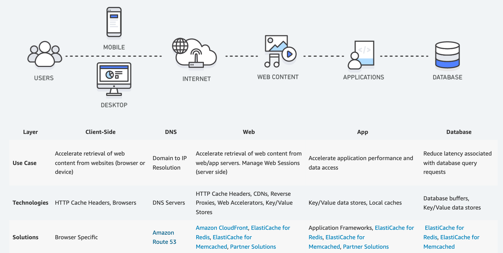

---
date: 2022-01-06
draft: false
thumbnail: /post-images/cache.png
title: Caching
extract: Notes for Caching
categories:
    - AWS
tags:
    - blog
    - AWS
--- 

### Table of Contents

- [What is Caching?](#what-is-caching)
- [How does Caching work?](#how-does-caching-work)
- [Caching Overview](#caching-overview)
- [What is CloudFront?](#what-is-cloudfront)
  - [How CloudFront works](#how-cloudfront-works)
  - [How CloudFront delivers content to your users](#how-cloudfront-delivers-content-to-your-users)

## What is [Caching](https://aws.amazon.com/caching/)?

In computing, a cache is a high-speed data storage layer which stores a subset of data, typically transient in nature, so that future requests for that data are served up faster than is possible by accessing the data’s primary storage location. Caching allows you to efficiently reuse previously retrieved or computed data.

## How does Caching work?

The data in a cache is generally stored in fast access hardware such as RAM (Random-access memory) and may also be used in correlation with a software component. A cache's primary purpose is to increase data retrieval performance by reducing the need to access the underlying slower storage layer.

Trading off capacity for speed, a cache typically stores a subset of data transiently, in contrast to databases whose data is usually complete and durable.

## Caching Overview

- RAM and In-Memory Engines 

Due to the high request rates or IOPS (Input/Output operations per second) supported by RAM and In-Memory engines, caching results in improved data retrieval performance and reduces cost at scale. To support the same scale with traditional databases and disk-based hardware, additional resources would be required. These additional resources drive up cost and still fail to achieve the low latency performance provided by an In-Memory cache.

- Applications 

Caches can be applied and leveraged throughout various layers of technology including Operating Systems, Networking layers including Content Delivery Networks (CDN) and DNS, web applications, and Databases. You can use caching to significantly reduce latency and improve IOPS for many read-heavy application workloads

- Caching Best Practices

When implementing a cache layer, it’s important to understand the validity of the data being cached. A successful cache results in a high hit rate which means the data was present when fetched. A cache miss occurs when the data fetched was not present in the cache. Controls such as TTLs (Time to live) can be applied to expire the data accordingly. Another consideration may be whether or not the cache environment needs to be Highly Available, which can be satisfied by In-Memory engines such as Redis.

Here're possible scenarios where caching can be implemented in your architecture:

[Image Credit: AWS Docs](https://aws.amazon.com/caching/)

We'll specifically look at CloudFront, ElastiCache, DAX and Global Accelerator.

## What is [CloudFront](https://docs.aws.amazon.com/AmazonCloudFront/latest/DeveloperGuide/Introduction.html)?

Amazon CloudFront is a web service that speeds up distribution of your static and dynamic web content, such as .html, .css, .js, and image files, to your users. CloudFront delivers your content through a worldwide network of data centers called edge locations. When a user requests content that you're serving with CloudFront, the request is routed to the edge location that provides the lowest latency (time delay), so that content is delivered with the best possible performance.

If the content is already in the edge location with the lowest latency, CloudFront delivers it immediately.

If the content is not in that edge location, CloudFront retrieves it from an origin that you've defined—such as an Amazon S3 bucket, a MediaPackage channel, or an HTTP server (for example, a web server) that you have identified as the source for the definitive version of your content.

### How CloudFront works

You create a CloudFront distribution to tell CloudFront where you want content to be delivered from, and the details about how to track and manage content delivery. Then CloudFront uses computers—edge servers—that are close to your viewers to deliver that content quickly when someone wants to see it or use it.

[Image Credit: AWS Docs](https://docs.aws.amazon.com/AmazonCloudFront/latest/DeveloperGuide/Introduction.html)

1. You specify origin servers, like an Amazon S3 bucket or your own HTTP server, from which CloudFront gets your files which will then be distributed from CloudFront edge locations all over the world.

An origin server stores the original, definitive version of your objects. If you're serving content over HTTP, your origin server is either an Amazon S3 bucket or an HTTP server, such as a web server. Your HTTP server can run on an Amazon Elastic Compute Cloud (Amazon EC2) instance or on a server that you manage; these servers are also known as custom origins.

2. You upload your files to your origin servers. Your files, also known as objects, typically include web pages, images, and media files, but can be anything that can be served over HTTP.

If you're using an Amazon S3 bucket as an origin server, you can make the objects in your bucket publicly readable, so that anyone who knows the CloudFront URLs for your objects can access them. You also have the option of keeping objects private and controlling who accesses them. See Serving private content with signed URLs and signed cookies.

3. You create a CloudFront distribution, which tells CloudFront which origin servers to get your files from when users request the files through your web site or application. At the same time, you specify details such as whether you want CloudFront to log all requests and whether you want the distribution to be enabled as soon as it's created.

4. CloudFront assigns a domain name to your new distribution that you can see in the CloudFront console, or that is returned in the response to a programmatic request, for example, an API request. If you like, you can add an alternate domain name to use instead.

5. CloudFront sends your distribution's configuration (but not your content) to all of its edge locations or points of presence (POPs)— collections of servers in geographically-dispersed data centers where CloudFront caches copies of your files.

As you develop your website or application, you use the domain name that CloudFront provides for your URLs. For example, if CloudFront returns d111111abcdef8.cloudfront.net as the domain name for your distribution, the URL for logo.jpg in your Amazon S3 bucket (or in the root directory on an HTTP server) is http://d111111abcdef8.cloudfront.net/logo.jpg.

Or you can set up CloudFront to use your own domain name with your distribution. In that case, the URL might be http://www.example.com/logo.jpg.

Optionally, you can configure your origin server to add headers to the files, to indicate how long you want the files to stay in the cache in CloudFront edge locations. By default, each file stays in an edge location for 24 hours before it expires. 

### How CloudFront delivers content to your users

After you configure CloudFront to deliver your content, here's what happens when users request your files:

A user accesses your website or application and requests one or more files, such as an image file and an HTML file.

DNS routes the request to the CloudFront POP (edge location) that can best serve the request—typically the nearest CloudFront POP in terms of latency—and routes the request to that edge location.

In the POP, CloudFront checks its cache for the requested files. If the files are in the cache, CloudFront returns them to the user. If the files are not in the cache, it does the following:

    - CloudFront compares the request with the specifications in your distribution and forwards the request for the files to your origin server for the corresponding file type—for example, to your Amazon S3 bucket for image files and to your HTTP server for HTML files.

    - The origin servers send the files back to the edge location.

    - As soon as the first byte arrives from the origin, CloudFront begins to forward the files to the user. CloudFront also adds the files to the cache in the edge location for the next time someone requests those files.

